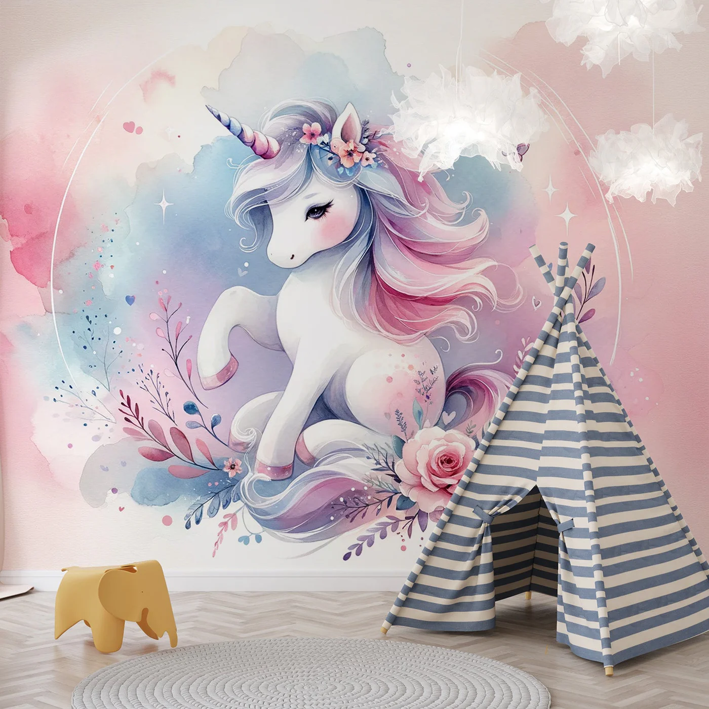
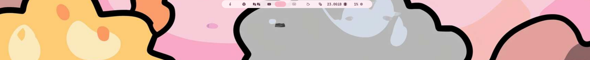

# omarchy-unicorn-dream-theme  
&nbsp;  
&nbsp;    
Unicorn Pastel theme aimed at little girls who may have Omarchy on their PCs.. or just anyone who likes this Pallete and unicorns includes a matching themes for GTK3/GTK4, Waybar, and Vesktop
&nbsp;  
&nbsp;  
&nbsp;  
# Screenshot:  
 
&nbsp;  
&nbsp;  
&nbsp;   
&nbsp;  
&nbsp;        
# Backgrounds:  
   
  
  
  
  
 &nbsp;
 &nbsp;  
 &nbsp;     
 &nbsp;   
 &nbsp; 
# Installation Theme  
 &nbsp; 
To install this theme, simply use the omarchy-theme-install command:  
&nbsp;  
```omarchy-theme-install https://github.com/Deoxizn/omarchy-unicorn-dream-theme.git```  
&nbsp;    
&nbsp;  
&nbsp;    
&nbsp;      
# Vesktop-Theme  
 &nbsp; 
For Vesktop users, you can install this theme by copying the theme file to your Vesktop themes directory:  
&nbsp;  
```cp ~/.config/omarchy/themes/unicorn-dream/vencord.theme.css ~/.config/vesktop/themes/vencord.theme.css```
&nbsp;    
&nbsp;  
&nbsp;    
&nbsp;      
# Waybar-Theme  
 &nbsp; 
  
 &nbsp; 
For the waybar, you can install this theme by copying the config.jsonc file and style.css to your waybar directory:  
&nbsp;   
```yay -S waybar-module-pacman-updates-git```  
```cp -r ~/.config/omarchy/themes/unicorn-dream/waybar ~/.config/waybar```
&nbsp;    
&nbsp;  
&nbsp;    
&nbsp;      
# GTK3.0/GTK4.0-Theme  
&nbsp;  
&nbsp; 
&nbsp; For GTK File Managers, you can install this theme by copying the toml file to your ~/.config directory:    
&nbsp;   
```cp -r ~/.config/omarchy/themes/unicorn-dream/gtk-3.0 ~/.config/```  
```cp -r ~/.config/omarchy/themes/unicorn-dream/gtk-4.0 ~/.config/```
